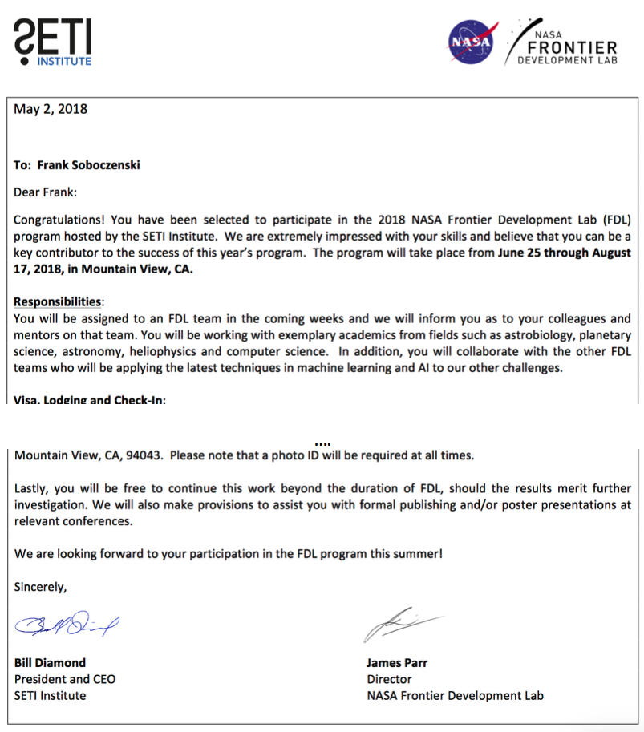
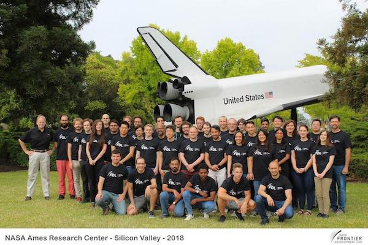
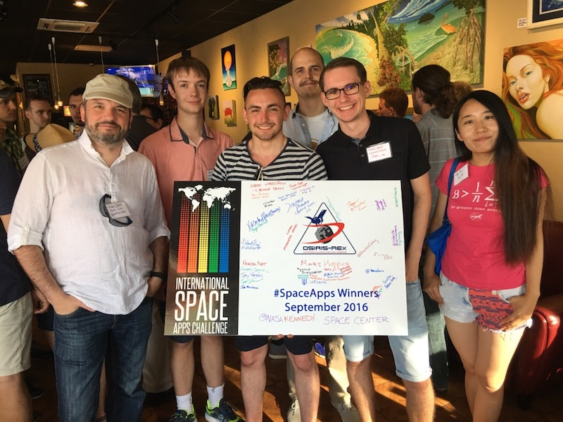

---
output:
  html_document: 
    toc: true
    toc_float: true
---

<link rel="stylesheet" href="styles.css" type="text/css">

I consider myself fortunate and privilledged to work with so many brilliant minds over the last view years. 
This page lists some of my work with NASA. 

## NASA Technosignatures Workshop

More news on this amazing project, soon!!
<!-- 
I have been accepted to the [NASA Globe Program](https://www.globe.gov/) as STEM scientist in the area of artificial intelligence and machine-learning. 

NASA Globe is a global science and education program supported by the [National Science Foundation](https://www.nsf.gov/), [National Oceanic and Athmospheric Administration](http://www.noaa.gov/) and the [United States Department of State](https://www.state.gov/).
 -->

## NASA Globe Program

I have been accepted to the [NASA Globe Program](https://www.globe.gov/) as STEM scientist in the area of artificial intelligence and machine-learning. 

NASA Globe is a global science and education program supported by the [National Science Foundation](https://www.nsf.gov/), [National Oceanic and Athmospheric Administration](http://www.noaa.gov/) and the [United States Department of State](https://www.state.gov/).

My pofile can be found [here](https://www.globe.gov/web/frank.soboczenski/home).

## NASA FDL

I am accepted and invited to join the legendary <b>NASA Frontier Development Lab (FDL)</b> at the [SETI Institute](https://www.seti.org/) in Mountain View, California.

Frontier Development Lab acceptance and invitation letter

NASA Frontier Development Lab 2018 Group Picture

My project that I am continue to work on is:

#### Astrobiology Team II - partnered with [Google Cloud](https://cloud.google.com/)

<b>From biohints to confirmed evidence of life on exoplanets within given environmental substrates.</b>

Environmental change and biological evolution are intrinsically linked terrestrially, in a process known as coevolution. Therefore, it is fair to hypothesize that extraterrestrial environments may have coevolved a broad range of alternative life processes markedly different to those we observe on Earth. Can we deploy AI techniques to generate an extended parameter space for possible metabolisms based on given (observed) environmental conditions and substrates: AKA “biohints” - potentially constrained by predictable behaviors of chemistry over a range of pressures and temperatures? This challenge would look at new tools to help determine if planetary data already gathered from Exoplanet Surveys contains biohints - in turn creating workflows to take these observed ingredients to produce plausible biochemistries and possible models of life on Exoplanets to inform further investigation.

<!-- 
Show tomorrow's sun today</b> 
The goal of this challenge would use many terabytes of historic SDO AIA images to build a neural net model to produce a forecast of what the sun will look like 24 hours into the future. The trained neural net model would ingest a time-series sequence of AIA images leading up to the present moment, and output an image of the sun as it is predicted to appear in 24 hours.

<b>Predicting solar spectral irradiance from SDO/AIA observations</b> 
Solar spectral irradiance is a critical factor for determining the properties of the Earth's upper atmosphere. Its short-term variability due to solar flares and CMEs could significantly disturb the upper atmosphere of the Earth and increase atmospheric drag on orbiting satellites. The goal of this challenge is to develop an AI model which uses SDO/AIA images to predict solar spectral irradiance (SSI) at Extreme Ultraviolet (EUV), and soft X-ray wavelengths. The EUV/X-ray SSI is an important energy input for terrestrial upper atmospheric models, which has important implications for everything from satellite orbital drag to the long-term evolution of the Earth’s atmosphere.

 -->
 
<!--  ### Category II: Exoplanet Detection (TESS Mission Data)

<b>Increase the efficacy and yield of exoplanets detection from TESS</b> 
<b>Team supported and partnered with [Google Cloud](https://cloud.google.com/)</b>
TESS’s mission to discern credible exoplanet signatures is an imposing data task. Moreover any follow-up strategy to further examine interesting candidates is made more demanding because of a mission time constraint, where follow-ups need to be identified each and every month as the spacecraft changes its field of view. At the moment, diagnosis of Exoplanet candidates still requires manual analysis - an impossibly big challenge for humans in the time window available. This time crunch problem remains unresolved, but may be suited to AI approaches. Can we develop AI techniques to resolve the time window problem, by automating the classification analysis currently done by human experts?

<b>Codify the process of AI derived exoplanet discovery and Cclassification to help TESS better discern rocky planets.</b> 
Can we use data from Kepler, K2 and and human analysis to develop a method to improve TESS’s ‘Lilith’ simulator factoring a range of stellar properties and occurrence rates and well as develop an ‘explainable AI’ that can learn to better discern rocky classifications as time goes on and identify the key features factored in the analysis? In addition to possible improvements to Lilith this challenge would look to identify improvements to the detection pipeline, not just in the transit detection but also upstream data reduction. I.e. what pixel calibration errors are most detrimental? how best to remove systematics? which systematics cause the most issues? and also identifying improved vetoes in the transiting planet search module.
 -->

## NASA Space Apps 

For more than five years, I am active as lead-organiser or organising comittee member of the NASA Space Apps Challenge in York. I look back on many amazing memories and fantastic software development moments. More information can be found at [Space Apps Challenge](https://2017.spaceappschallenge.org/) or the previous York specific events:

- [NASA Space Apps York 2017](https://2017.spaceappschallenge.org/locations/york/) 
- [NASA Space Apps York 2016](https://2016.spaceappschallenge.org/locations/york-england) 
- [NASA Space Apps York 2015]() 
- [NASA Space Apps York 2014]() 
- [NASA Space Apps York 2013]() 

Our team [LaunchSight]() won the 2016 Challenge and was invited amonst other global winning teams to [NASA Kennedy Space Center](https://www.kennedyspacecenter.com/). We had the opportunity to meet so many amazing people and attend the [OSIRIS REx](https://www.asteroidmission.org/) mission launch. <!--X the Z, Beth the C and R the x were among the many amazing people I've met at my time at NASA. -->

Space Apps York - Winning Team **Launch Sight** with organisers @ NASA Kennedy Space Center

Additional pictures can be found here: (link soon available).
 
## NASA ENSPIRES 

<!--
I currently serve as program reviewer for the Translational Research Institute for Space Health (TRISH) project under the Biomedical Research Advances for Space Health (BRASH) branch.
  -->
