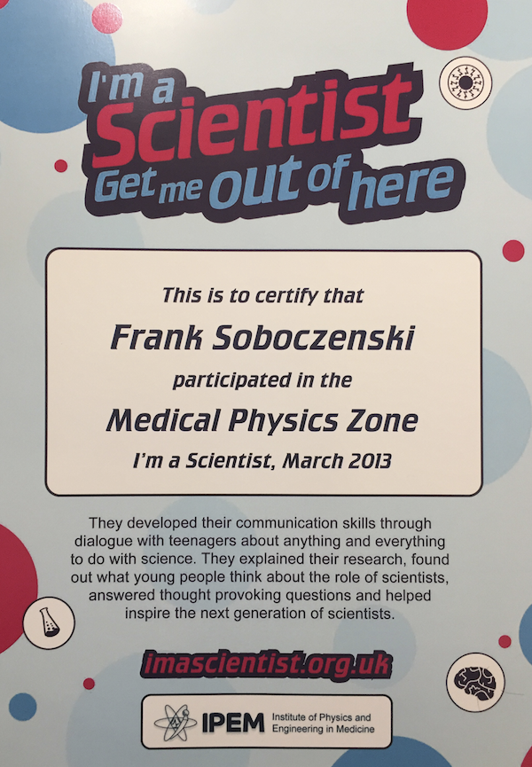

---
output:
  html_document: 
    toc: true
    toc_float: true
---

<link rel="stylesheet" href="styles.css" type="text/css">

## Upcoming Events

- [NASA GLOBE Program Machine learning workshop](https://www.globe.gov)  <b>-> more news soon<-</b> 
- [NASA Space Apps Challenge](https://www.spaceappschallenge.org) I'll help organising this year's NASA Space Apps <b>-> more news soon<-</b> 
- [13th Excellence in Teaching Conference](https://www.kcl.ac.uk/academy/educators-network/Excellence-in-Teaching-Conference.aspx) I plan to lead a workshop on modern teaching & research technology <b>-> more news soon<-</b> 
- RobotReviewer Day I'll be heading an outreach event on our project software and its capabilities <b>-> more news soon<-</b> 
- Machine Learning for Health Researchers I'll be leading this workshop at King's College London <b>-> more news soon<-</b> 
- NASA GLOBE STEM Event I'm working on hosting this School event <b>-> more news soon<-</b> 

## Past Events

### King's College London

- [11th Excellence in Teaching Conference](https://www.kcl.ac.uk/academy/educators-network/Excellence-in-Teaching-Conference.aspx)

### University of York

- [NASA SpaceApps York](http://www.spaceappschallenge.org/) 

Lead Organiser of SpaceApps York - NASA’s global and largest hackathon in the world. Over 90 cities participated in this weekend-event. Established live-links with NASA Tallahassee, and other locations in the world. Over Fifty local students worked in teams on world-class challenges resulting in a finalist in 2015 and a <b>winning team in 2016</b>.

- [York Space Weekend - UK Space Agency's Schools Conferences](https://principia.org.uk/schools-conferences/york/) 

Represented NASA SpaceApps York and the department of computer science at this fantastic event for school children with UK Astronaut <b>Tim Peake</b>. Presented new technologies and applications for space and science including our winning team's application Launch Sight to hundreds of youngsters (2016).

- [Next Steps York Program](https://sites.google.com/a/york.ac.uk/r-users-york/news/rseminarseriesr-markdown?pli=1) 

Gave programming lectures in games design and programming in Python & Scratch to potential new undergraduate students. The purpose of this event is to provide talented Year 12 students with the opportunity to participate in a programme of activity that will support their application to a research intensive university like the University of York (2016).

- ["I am a scientist get me out of here" Competition (Wellcome Trust)](https://medphysm13.imascientist.org.uk/profile/franksoboczenski/) 

Participated in this fantastic event where I could chat with hundreds of school children about science. Made 2nd place in the medical physics zone (2013).

