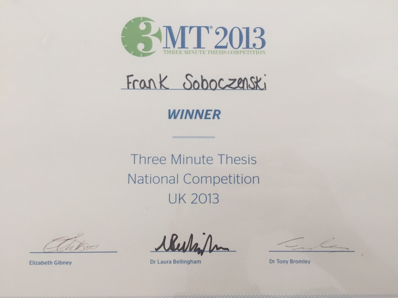

---
output:
  html_document: 
    toc: true
    toc_float: true
---

<link rel="stylesheet" href="styles.css" type="text/css">

## Research Interests

Artificial intelligence (deep learning/machine learning), baysian analytics and human-computer interaction focused on medical device as well as aviation systems safety including big data analysis & visualisation: human error, empirical studies, perceptual interference, disfluencey, cognitive theory, augmented reality, probabilistic timing analysis, software modeling, autonomous systems, robotics, unmanned-areal vehicle control systems, flight-deck system safety, cyber-security, forensics

## Current focus at King's College London

I am currently working on the [Robotreviewer](http://www.robotreviewer.net/) (MRC/NIH Fellowship) project: working on novel methods for <b>automatic bias assessment</b> in systematic reviews based on <b>natural language processing</b> and state-of-the-art <b>deep-learning algorithms</b>; supervising user-experience studies; evaluating neural text extraction and classification models

## Research Grant

My research is supported by [NVIDIA Corporation](http://www.nvidia.com/) via the [NVIDIA academic GPU grant program](https://developer.nvidia.com/academic_gpu_seeding).

## Popular Media

I won the first **UK national 3Minutes Thesis Competition** in 2013 hosted by the University of Leeds:

**Soboczenski, F.** “Sum up your thesis: Reducing number-entry errors in medical devices”,
**Times Higher Education**, 2013. [https://goo.gl/oQrWSq](https://goo.gl/oQrWSq)

**Soboczenski, F.** "Gone in 180 Seconds”,  **Times Higher Education **, 2013. [https://www.timeshighereducation.com/gone-in-180-seconds/2005390.article](https://www.timeshighereducation.com/gone-in-180-seconds/2005390.article)

## Referred Journal Articles

**Soboczenski, F.**, Hudson M. & Cairns P., (2016). The Effects of Perceptual Interference on Number-Entry Errors. *Interacting with Computers (IwC)*, 28, vol (2), p. 208 - 218, doi: 10.1093/iwc/iwv034

**Soboczenski, F.**, Hudson M. & Cairns P., (2016). The Effects of Perceptual Interference on Number-Entry Errors. *Interacting with Computers (IwC)*, 28, vol (2), p. 208 - 218, doi: 10.1093/iwc/iwv034

**Soboczenski, F.**, Hudson M. & Cairns P., (2016). The Effects of Perceptual Interference on Number-Entry Errors. *Interacting with Computers (IwC)*, 28, vol (2), p. 208 - 218, doi: 10.1093/iwc/iwv034

## Conference Publications

Griffin, D., Lesage, B., Bate, I., **Soboczenski, F.** & Davis, R., (2017). Forecast-Based Interference: Modelling Multicore Interference from Observable Factors. *Proceedings of the 25th International Conference on Real-Time Networks and Systems - RTNS ’17 *(2017).

Lesage, B., Griffin, D., Bate, I. & **Soboczenski, F.**, (2017). Exploring and Understanding Multicore Interference from Observable Factors. *In Proceedings of Automotive - Safety & Security* (2017)

Griffin, D., Bate, I., Lesage, B. & **Soboczenski, F.**, (2016). Evaluating Mixed Criticality Scheduling Algorithms with Realistic Workloads. *In Proceedings of the 3rd Workshop on Mixed Criticality Systems* (2016)

Maxim, D., **Soboczenski, F.**, Bate, I. & Tovar, E., (2015). Study of the Reliability of Sta- tistical Timing Analysis for Real-Time Systems. *Proceedings of the 23rd International Conference on Real Time and Networks Systems - RTNS ’15 *(2015)

Lesage, B., Griffin, D., **Soboczenski, F.**, Bate, I., & Davis, R., (2015). A Framework for the Evaluation of Measurement-based Timing Analyses. *Proceedings of the 23rd International Conference on Real Time and Networks Systems - RTNS ’15 *(2015)

Griffin, D., Lesage B., **Soboczenski F.**, Bate, I. & Davis, R., (2015). Modelling Fault Dependencies when Execution Time Budgets are Exceeded. *Proceedings of the 23rd International Conference on Real Time and Networks Systems - RTNS ’15 *(2015)

Borghouts, J., **Soboczenski, F.**, Cairns P. & Brumby, D., (2015). Visualising Magnitude: Graphical Number Representations Help Users Detect Large Number Entry Errors. *In proceedings of the Human Factors and Ergonomics Society (HFES) 2015 International Annual Meeting, Los Angeles* - **(Best Paper Award)**

**Soboczenski, F.**, Hudson M. & Cairns P., (2014). The Effects of Perceptual Interference on Number- Entry Errors. *Proceedings of the first Int. conf. on Interaction Design and Human Factors, Kochi Japan*.

**Soboczenski, F.**, Cairns, P., & Cox, A. L. (2013). Increasing Accuracy by Decreasing Pre- sentation Quality in Transcription Tasks. *In Human-Computer Interaction Proc. Interact 2013*, Springer LNCS 8118 (pp. 380-394)

**Soboczenski, F.**, Datta, A. & Cairns, P. (2013). Reducing Number-Entry Errors in Medical Systems: A Tale of Two Studies. *In proceedings of the 6th York Doctoral Symposium on Computer Science and Electronics* 2013 (pp. 94)

## Conference Posters

**Soboczenski, F.** (2014). 5-Key interfaces for medical devices. *British Computer Society - Doctoral Consortium on design and interfaces*.

**Soboczenski, F.** (2013). Reducing Number-Entry Errors in Healthcare. *Poster presented at the BCS Health Informatics Conference Scotland* 2013

**Soboczenski, F.** (2013). A tale of two studies. *Poster presented at the 6th York Doctoral Symposium on Computer Science and Electronics* 2013

## Other Publications

**Soboczenski, F.** (2014) The Effect of Interface Elements on Transcription Tasks to Reduce Number-Entry Errors. *PhD thesis, University of York*.

**Soboczenski, F.** (2009) Ontology Based Modeling Rules for the Unified Modeling Language (UML). *Diploma thesis, Deggendorf Institute of Technology, Germany*.

## Items in preparation

**Soboczenski, F.**, X & Y, (2018). Now you see me - counterintuitive solutions to reduce human error.

**Soboczenski, F.** (2018). An introduction to R - from simple statistics to machine learning applications. *First manuscript available on Github*

## Students advising 

**Joyce Tlhoolebe - MSc** 
Graduate student in Cyber-Security, University of York. *Object selection as a biometric authentication system*, (2016).

**Qianyun Jiang - MSc** 
Graduate student in Cyber-Security, University of York. *Malware Identification*, (2016).

**Raya Al-Khayari - MSc** 
Graduate student in Cyber-Security, University of York. *An analysis of vulnerability disclosure mechanisms*, (2016).

**Rashid Al-Saidi - MSc** 
Graduate student in Cyber-Security, University of York. *Detecting and distinguishing encrypted from compressed containers*, (2016).

**Judith Borghouts - MSc** (Co-supervised with Dr. Paul Cairns) 
Graduate student in Human-Centered Interactive Technologies, University of York. *The effect of different design features on reducing number-entry errors in medical devices*, (2013).

**Aniket Datta - BSc** 
Undergraduate student in Human-Centered Interactive Technologies, University of York. *Chevron interface studies on reducing number-entry errors in medical devices*, (2013).

## [Google scholar]()

A full list of publications is available at the above Google scholar link.

